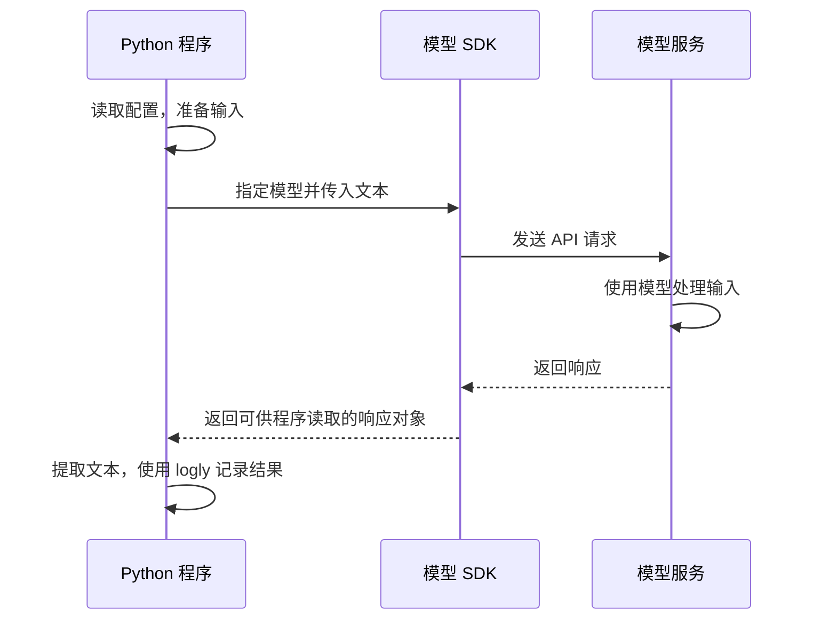

# P0 基础：第一次模型调用

关联文档：[需求文档](../requirements.md) · [技术路线](../technical-roadmap.md) · [任务清单](../tasks.md)

当前状态：单次模型调用已实现，使用 openai 3.13.0。运行 `uv run hello-agent`，配置说明见 [README](../../README.md)。2026-09-13 已验证受控成功响应、空响应退出与配置缺失提示；用户已于 2026-09-13 确认真实模型调用跑通。当前配置在模块导入时初始化，无效配置由 Pydantic 直接报告；此前的自定义配置缺失提示已移除。

2026-09-13 选型记录：用户指定按 OpenAI compatible 调用。采用 `client.chat.completions.create`，通过 `model` 与 `messages` 提交请求，从 `choices[0].message.content` 读取回复文本；接口结构参考 [OpenAI Chat API 文档](https://developers.openai.com/api/reference/resources/chat)。兼容服务是否支持具体参数，需要在真实运行时验证。初期采用命令行固定输入、同步非流式调用；实际服务地址、模型名称和密钥由 `.env` 提供，不绑定某家服务或预设模型。

## 1. 本次学习目标

通过 Python 调用一次模型，发送一段文字，接收回复，并使用 `logly` 输出结果。

完成后，应能解释：

- 模型、模型服务、API 和 SDK 分别是什么。
- 一段输入如何从 Python 程序到达模型服务。
- 模型服务返回什么，程序如何从响应中取得回复。
- 哪些信息属于配置，哪些属于本次输入，哪些属于输出。

这是后续 Agent 的基础。本次只完成单次文本请求与响应；工具调用在 P0 的下一步学习，自动循环在 P1 学习。

## 2. 先认识几个概念

| 概念 | 本次如何理解 | 在实验中的作用 |
| --- | --- | --- |
| 模型 | 根据输入上下文生成输出的模型 | 生成回复 |
| 模型服务 | 运行模型并接收调用请求的服务 | 提供可访问的调用入口 |
| API | 服务对外约定的调用接口 | 规定请求和响应如何组织 |
| SDK | 帮助开发者调用 API 的程序库 | 用 Python 方法封装请求发送与响应处理 |
| 客户端 | 根据配置创建的调用对象 | 保存连接设置并发起请求 |
| 提示词（Prompt） | 提供给模型的任务、说明或上下文 | 本次先使用一句简单指令 |
| 请求（Request） | 程序发送给服务的一次调用数据 | 包含所选模型、输入及相关参数 |
| 响应（Response） | 服务返回给程序的结果数据 | 包含输出内容，也可能有状态和用量等信息 |

模型名称和 SDK 名称是两回事：模型决定请求交给哪个模型处理，SDK 决定我们如何用 Python 调用接口。

SDK 也不等于 Agent 框架。使用 SDK 可以完成模型调用，而后续何时调用模型、是否执行工具、如何继续和结束，将由我们的程序逐步实现。

## 3. 一次调用怎样发生



阅读这个过程时，注意两个位置：

1. Python 程序在本地组织请求；通过远程模型 API 调用时，模型计算发生在服务端。
2. 响应对象通常不只是一个字符串。我们需要按照所选 API 和 SDK 的结构，取得实际回复文本。

本阶段使用 Chat Completions 请求与响应格式，先仅发送模型名称与一条用户消息。

## 4. 区分配置、输入和输出

### 配置：程序需要连接谁

| 配置项 | 用途 | 当前决定 |
| --- | --- | --- |
| 模型服务 | 确定使用哪家的服务 | OpenAI 兼容服务，通过 LLM_BASE_URL 配置 |
| 模型名称 | 指定处理请求的模型 | 通过 LLM_MODEL 配置服务支持的模型标识 |
| 模型 SDK | 确定使用哪个 Python 客户端库 | openai Python SDK |
| 认证信息 | 让服务识别调用者及其权限；常见方式是 API Key | 根据服务确定，密钥不写入代码、日志或 Git |
| 服务地址 | 指定 API 入口；部分 SDK 提供默认地址 | 填写服务提供的 API 基础地址，不包含 /chat/completions |
| 请求超时 | 防止程序无期限等待 | LLM_TIMEOUT，当前默认 30 秒 |

Python 版本使用 3.14，依赖通过 uv 管理。接入时检查 SDK 与 `logly` 的兼容性。

### 输入：本次想让模型做什么

建议第一条实验输入为：

> 请用一句中文解释什么是 AI Agent。

这条输入足够短，容易判断回复是否相关，也无需外部工具或实时数据。初版在命令行运行，以它作为固定输入，先观察完整调用过程。

### 输出：程序实际拿到了什么

首先找到最终回复文本。如果接口还返回请求标识、完成状态或用量信息，可以观察其含义；具体有哪些字段以所选接口为准。

Token 是模型处理文本时使用的分片单位，不能直接等同于一个字或一个单词。若响应提供 Token 用量，可以记录服务返回的数值；不要自行用字数冒充用量。

相同输入的回复可能有所不同。验收时检查内容相关、可以读取，不要求逐字匹配固定答案。

## 5. 最小实验计划

下列步骤已完成单次调用实现，用户已确认真实调用跑通；关键字段的学习回顾待完成。

1. 确定模型服务、模型、SDK 和初期交互方式。
2. 用 uv 配置必要依赖，准备认证信息与模型设置。
3. 创建客户端，准备固定输入。
4. 发起一次模型调用，等待完整响应。
5. 按 SDK 的响应结构取得回复文本。
6. 使用 `logly` 记录结果和必要的执行信息，然后结束程序。
7. 验证缺少必要配置时的提示，记录成功与失败路径的观察结果。

本次优先采用容易顺序阅读的实现，等待完整响应后再输出。流式输出、并发、多轮会话、工具调用和 Agent 框架留到后续步骤。

预定代码位置为 `src/hello_agent/sdk/p00_basics/`；实际入口文件和运行命令在实现后补充。当前无需为一次请求建立通用客户端封装或 Web 服务。

## 6. 日志与失败反馈

项目统一使用 `logly`，不使用 `print`。初版日志应能帮助我们看清：

- 是否开始请求，以及调用的模型名称。
- 是否成功获得回复，以及回复文本。
- 如果失败，失败发生在哪一步及可理解的原因。

密钥不得出现在日志中。也不要为了观察结果而直接输出全部配置或认证请求头。

| 情况 | 应观察到的行为 |
| --- | --- |
| 缺少必要配置 | 请求发送前给出明确提示，结束本次运行 |
| 服务拒绝认证或模型不可访问 | 报告实际错误，不当作正常模型回复 |
| 连接失败或超时 | 说明请求未成功完成，不无限等待 |
| 返回可用回复 | 提取并记录文本，正常结束 |
| 没有取得可用文本 | 检查响应状态与结构，明确报告情况，不伪造成功结果 |

初版不编写自动重试循环。接入时了解 SDK 是否默认重试，避免把一次程序调用误认为必然只发送了一次网络请求。

## 7. 验收清单

文档完成不代表实验完成。以下项目在实现和验证后逐项勾选：

- [ ] 已记录实际模型服务、模型、SDK 和运行命令。
- [x] 能从项目环境运行示例，获得真实模型回复（用户确认）。
- [ ] 回复通过 `logly` 输出，未使用 `print`。
- [ ] 必要配置缺失时有明确提示，认证密钥没有写入代码或日志。
- [ ] 能指出代码中准备输入、发起请求、提取回复的三个位置。
- [ ] 能解释实际请求与响应中的关键字段。
- [ ] 已记录实验结果和遇到的问题，没有把预期结果写成实测结果。

学习后尝试用自己的话回答：

1. 我们安装了 SDK，是否意味着把模型安装在了本地？
2. 模型名称、认证信息、提示词分别承担什么作用？
3. 为什么需要从响应对象中提取文本？
4. 为什么这一步还没有实现工具选择与自动执行循环？

## 8. 实验记录：完成实现后填写

| 项目 | 当前记录 |
| --- | --- |
| 模型服务与模型 | OpenAI 兼容服务；实际地址与模型待在 .env 配置 |
| SDK 与版本 | openai 3.13.0；Python 3.14 环境安装成功 |
| 代码入口与运行命令 | src/hello_agent/sdk/p00_basics/single_call.py；uv run hello-agent |
| 实际输入与回复 | 2026-09-13 用户确认真实调用已跑通，未提供具体输入与回复原文 |
| 配置缺失等验证结果 | 此前受控成功与空响应验证通过；当前改为模块级配置实例，由 Pydantic 直接报告配置错误 |
| 遇到的问题与解决方式 | 待实验后记录 |

P0 的工具调用部分会在后续学习步骤补充。当前下一步是回顾请求与响应字段，再进入工具调用学习。

## 9. 单次工具调用：add

新增入口：`src/hello_agent/sdk/p00_basics/tool_call.py`。本步提供 `add(a, b)`，接受 -1e100 至 1e100 的有限数字；使用浮点加法，不用于精确财务计算。参数约束与 JSON Schema 统一由 Pydantic 的 `AddArguments` 定义。

```sh
uv run python -m hello_agent.sdk.p00_basics.tool_call
uv run python -m hello_agent.sdk.p00_basics.tool_call "你好，请介绍一下自己"
```

默认输入是“请使用工具计算 127 加 358。”，预期工具结果为 485。首次请求使用 `tool_choice="auto"`，允许直接回答；直接回答不代表工具链验收通过。

数据流与关键字段：

1. `messages` 保存用户输入；`tools` 向模型描述函数名称、用途和参数。
2. `choices[0].message.tool_calls` 是模型的调用请求。`function.arguments` 是 JSON 字符串，用 `model_validate_json` 解析和校验，程序只执行已注册的 `add`。
3. 保留包含工具请求的 assistant 消息，将 Python 结果作为 `role="tool"` 消息追加。`tool_call_id` 必须对应原调用的 `id`。
4. 第二次请求携带完整消息，使用 `tool_choice="none"` 请求最终回答，从 `message.content` 读取文本；`finish_reason="stop"` 表示正常结束。

模型负责提出调用请求，Python 执行函数。接口依据 [OpenAI Function calling 文档](https://developers.openai.com/api/docs/guides/function-calling)。

本步执行边界：最多执行一个工具、发送两次模型请求，SDK 自动重试关闭。未知工具、无效 JSON、参数类型或范围错误、多调用、空回复均停止并报告错误。第二次响应若继续请求工具也停止；P1 再引入循环。参数错误目前直接结束，不回传模型修复。

离线验证：`uv run python -m unittest discover -s tests`。2026-09-13 五项测试通过，覆盖结果关联、直接回答、无效调用不执行、禁止第三次请求与空回答。

真实验证（2026-09-13）：使用现有兼容服务与 gemini-2.5-flash，默认输入触发 add，参数 a=127.0、b=358.0，Python 返回 485.0；第二次模型回复为“127 加 358 的计算结果是 **485**。”，程序正常退出。沙箱内首次连接失败，获准联网后验证成功。

Schema 组织：工具参数、结果模型与 ADD_TOOL 位于 `src/hello_agent/schemas/tools.py`；配置模型位于 `src/hello_agent/schemas/config.py`。业务调用只导入这些定义，配置实例仍在 `config/settings.py` 初始化。

P0 学习回顾（2026-09-13）：用户已解释模型提出请求、runtime 执行工具，以及无状态请求需要上下文；已补充 tool_call_id 关联请求与结果，tool_choice=none 仅禁止当前请求调用工具。后续进入 P1，用最大步数控制循环。
